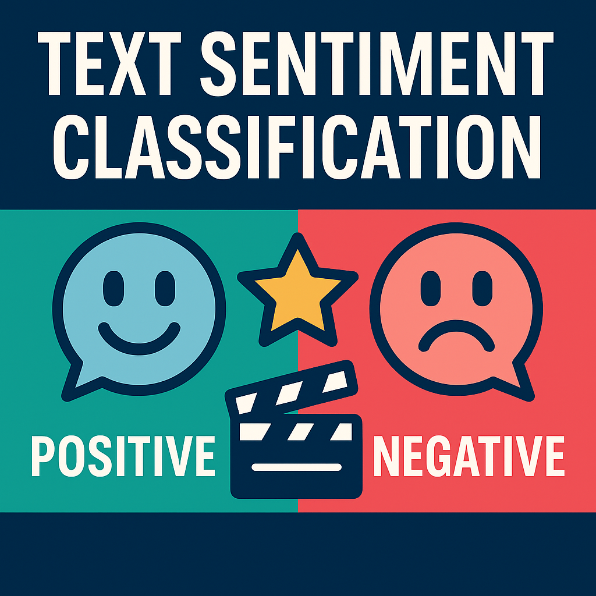

# 🎬 Text Sentiment Classification – Movie Reviews

This project applies machine learning techniques to classify movie reviews from IMDb as **positive** or **negative**.

---

## 🧠 Objective

To develop and compare machine learning models that can accurately detect sentiment in movie reviews using both classical and deep learning methods.

---

## 📂 Dataset

- Source: IMDb small reviews dataset
- Format: TSV file containing labeled movie reviews
- Class distribution: Binary (positive, negative)

---

## 🔧 Methods Used

- **EDA:** Class balance checks, length distributions
- **Text Preprocessing:** Tokenization, lemmatization, stopword removal
- **Vectorization:** 
  - TF-IDF
  - BERT embeddings (200 samples)
- **Modeling:** 
  - Logistic Regression
  - Random Forest Classifier
  - BERT + Logistic Regression
- **Evaluation:**
  - Accuracy
  - F1-score
  - ROC AUC

---

## 🚀 Key Results

- Achieved **F1-score ≥ 0.85** on test set using TF-IDF + Logistic Regression
- BERT embeddings improved model robustness on smaller data
- Demonstrated differences between classical ML and modern NLP pipelines

---

## 📌 Technologies Used

- Python
- NLTK / spaCy
- Scikit-learn
- Transformers (for BERT)
- Jupyter Notebook
